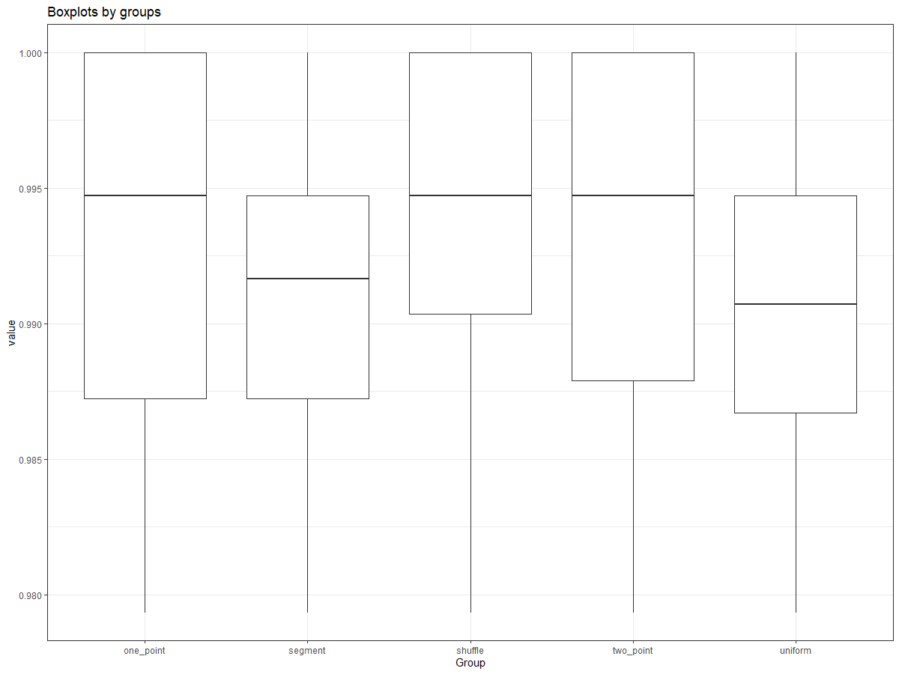
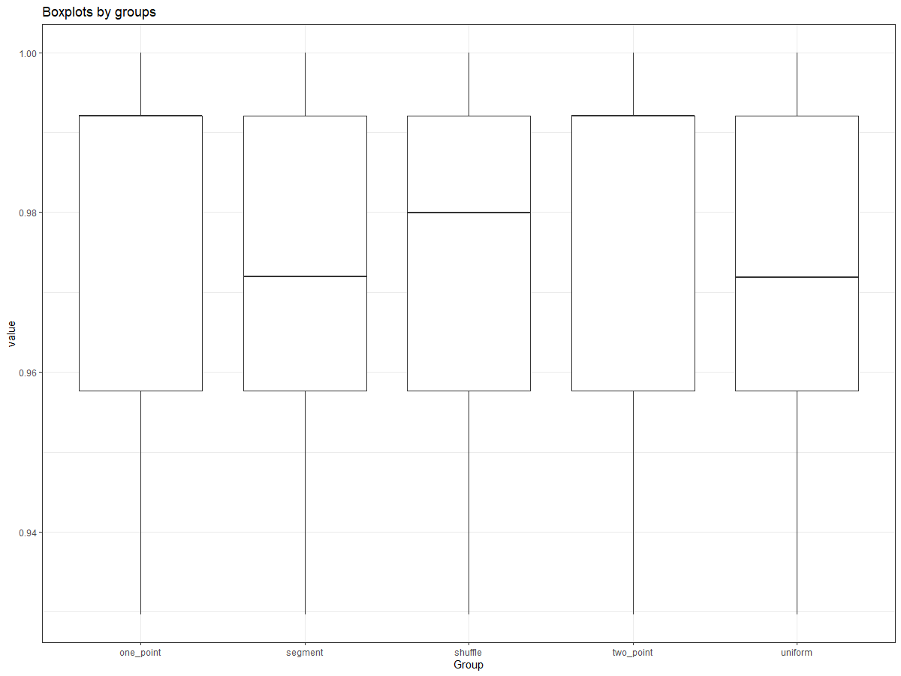
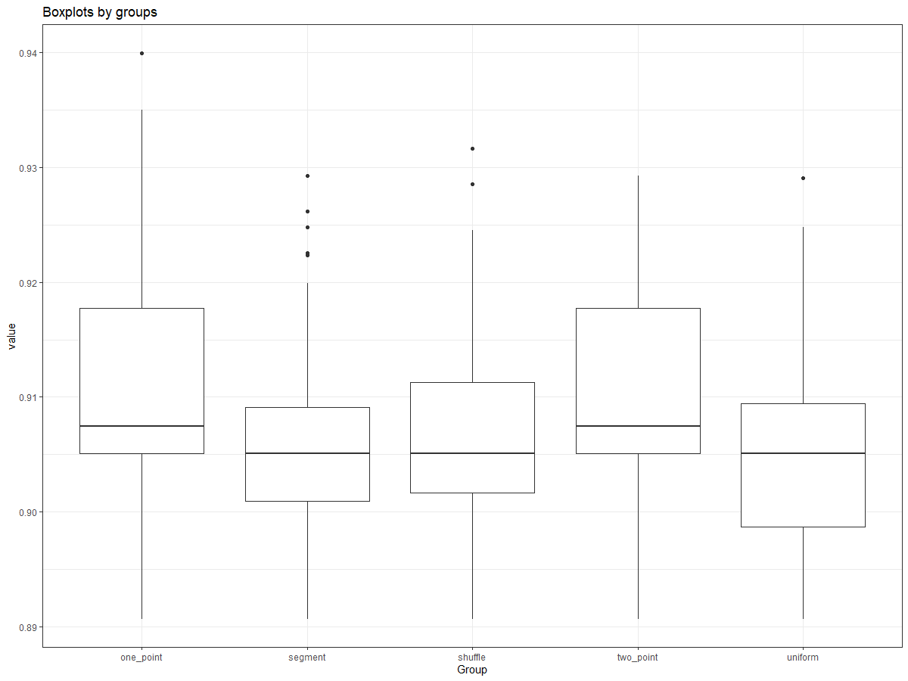
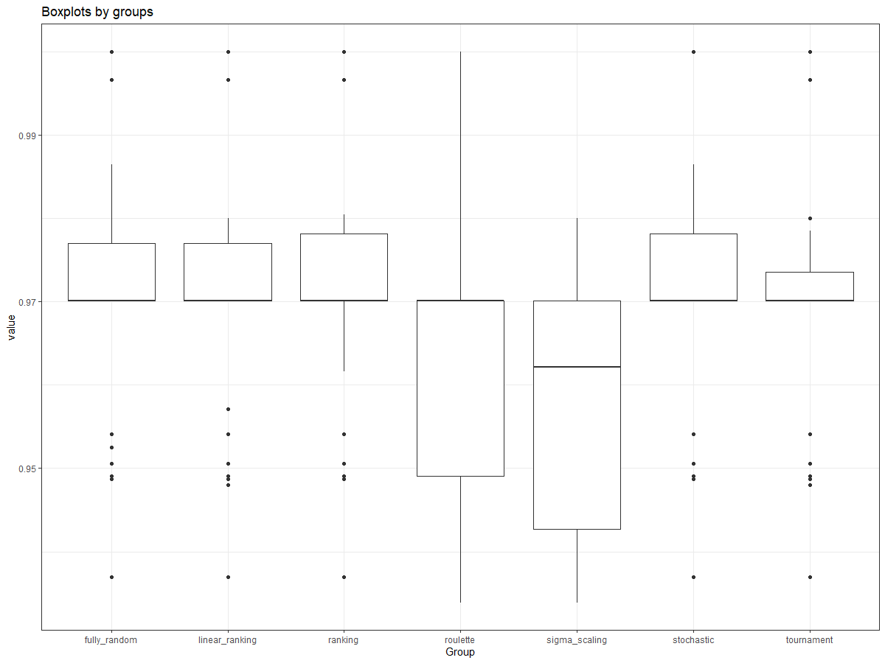
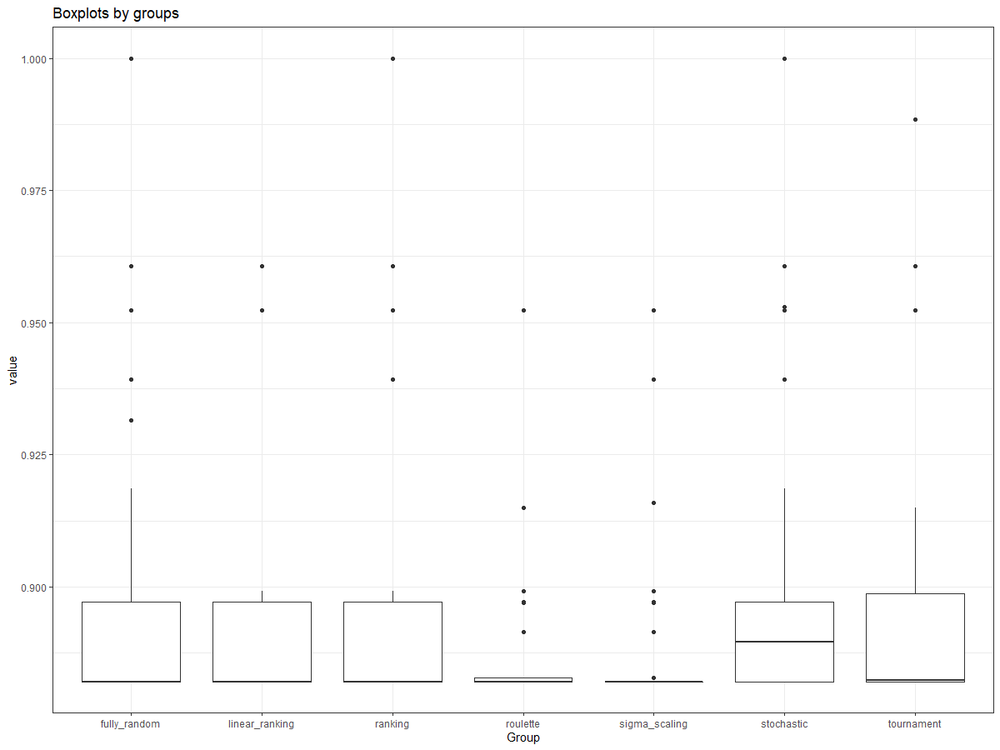
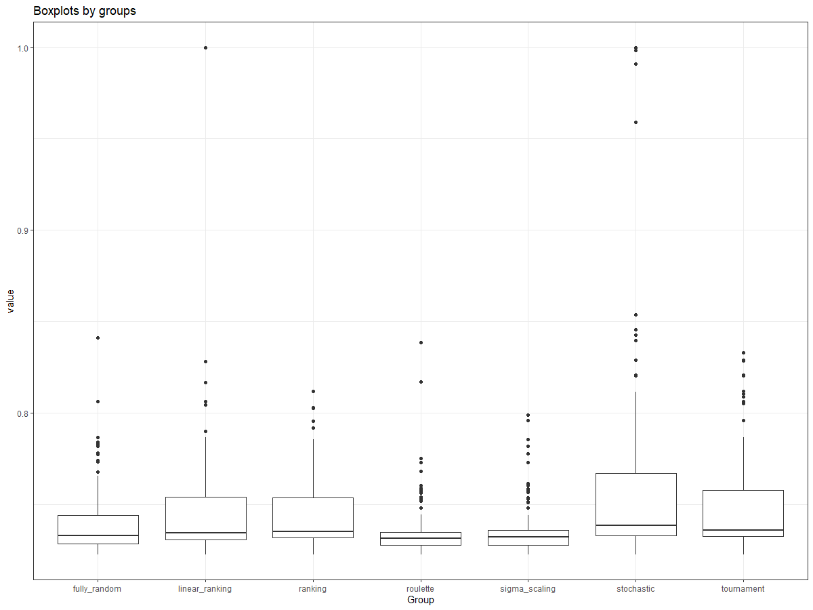

# ab-testing-results-difference

## About

Here there is a code for processing next task:

```
Select best 'optimization' algorithm from {a1, a2, a3, ..., an} if there are N samples results for each of them
```

For examples, there are 3 optimization methods like `a1(start_statement)`, `a2(start_statement)`, `a3(start_statement)` and u need to select which one is best for your task. For this u should run these algorithms `N` times (more times is better) and create table like (`N` rows for each simulation, 3 columns for each algorithm)

| a1  | a2  | a3  |
|---|---|---|
|  number11 | number12   | number13  |
| number21  | number22  | number23  |
| ...  | ...  | ...   |
| numberN1  | numberN2  | numberN3  |

U can use this table as **R dataframe** or export to `.csv` if u want.

In file [abtest.R](abtest.r) there is `ab_test(dataframe)` function for compare these algorithms with statistical analysis.

## Idea of method

The function provides these steps:

1. Check normal distribution for each column using [Anderson-Darling Test For Normality](https://www.rdocumentation.org/packages/nortest/versions/1.0-4/topics/ad.test)
2. If all columns are normal check presence of important differences using [Variance Analysis](https://www.rdocumentation.org/packages/stats/versions/3.6.2/topics/aov), otherwise [Kruskal-Wallis Rank Sum Test](https://www.rdocumentation.org/packages/stats/versions/3.6.2/topics/kruskal.test) 
3. If there are some important differences, compare each pair using:
    * [Student's T-Test](https://www.rdocumentation.org/packages/stats/versions/3.6.2/topics/t.test) if both columns are normal
    * [Wilcoxon Rank Sum And Signed Rank Tests](https://www.rdocumentation.org/packages/stats/versions/3.6.2/topics/wilcox.test) otherwise

## Output

At the end there will be the matrix like:
```
    a1  a2  a3
a1  0   1   -1
a2  -1   0   -1
a3  1   1   0
```

Where `[a1, a2] == 1` means that `mean(a1)` is importantly more than `mean(a2)` but `[a1, a3] == -1` means that `mean(a1)` is importantly less than `mean(a3)`

## Visualizations

During the working it also creates boxplot for comparing results. Next result examples are got from testing several hyperparameters' values of [genetic algorithm](https://github.com/PasaOpasen/geneticalgorithm2) realization for ration searching at [Nutrient planner](https://nplanner.ru)






